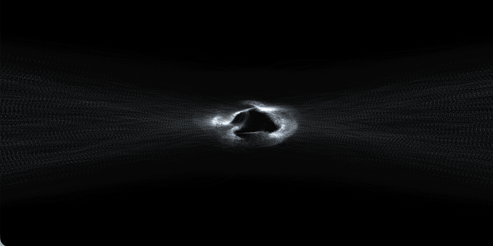

# Nuage de particules (PFE - Algorithme et impacts)

Projet de fin d'études (Bachelor Web Design). Visualisation interactive d'un nuage de particules WebGL2 pour matérialiser le fonctionnement et les impacts des algorithmes de recommandation des réseaux sociaux.

---

## À propos du projet

Dans le cadre de mon projet de fin d'études (PFE) en Bachelor Web Design, je conçois une expérience narrative et interactive autour des algorithmes de recommandation des réseaux sociaux et de leurs impacts sur les utilisateur·rices.

### Concept et intention

L'objectif est de réaliser un site web qui, à travers un *scrollytelling*, rend l'algorithme tangible et compréhensible : comment il fonctionne, et dans quelle mesure il influence notre expérience en ligne comme dans notre quotidien.

Ce projet s'adresse en priorité aux **15–25 ans**, qui représentent une part importante des utilisateur·rices des réseaux sociaux et constituent une population particulièrement vulnérable aux effets de ces plateformes. L'ambition est de leur offrir un outil de recul critique vis-à-vis de leurs usages numériques, afin de leur permettre de reprendre le contrôle sur leur expérience en ligne.

### Système visuel

L'algorithme est matérialisé par un **nuage de particules**. Chaque particule représente une donnée issue des interactions des utilisateur·rices : clics, temps de visionnage, likes, partages… Un flux continu de particules converge pour former ce nuage, métaphore visuelle d'un algorithme en perpétuel apprentissage.

Le nuage est en **mouvement constant**, ce qui traduit l'activité ininterrompue de cette technologie au cœur de l'économie de l'attention.

### Intégration au sein du projet

Le flux de particules et le nuage évoluent dynamiquement **au fil du scroll** de l'utilisateur·rice. Le nuage peut être centré à l'écran ou décalé sur le côté, laissant place à du contenu textuel qui documente le fonctionnement de l'algorithme et ses effets.

Des **interactions** (clic, survol, etc.) jalonnent l'expérience narrative pour la rendre plus engageante. Chacune d'elles influence l'intensité du flux et l'évolution du nuage illustrant ainsi que chaque action sur le web a un impact sur le contenu qui nous est proposé.

---

## Technologies

### WebGL2 & Transform Feedback

Le nuage de particules est rendu entièrement sur GPU grâce à **WebGL2** et à la technique du **Transform Feedback**, qui permet de calculer la position, la vitesse et l'âge de chaque particule sans passer par le CPU. Cela rend possible l'animation fluide de plusieurs dizaines de milliers de particules en temps réel.

### Bruit de Perlin

La forme organique et vivante du nuage est générée par un **champ de bruit de Perlin 3D**, évalué en temps réel dans le shader. Ce bruit crée des forces de turbulence qui donnent au nuage son aspect fluide et naturel, sans jamais se répéter exactement.

### Deux comportements distincts dans le shader

| Zone | Comportement |
|------|-------------|
| **Hors du nuage** | Attraction vers le centre + légère turbulence de Perlin (aspect fumée) + dérive latérale pour éviter les trajectoires parallèles |
| **Dans le nuage** | Fort amortissement pour absorber le momentum du flux entrant + bruit de Perlin intense pour une forme organique autonome |

### Évolution selon le scroll

| Scroll | `faceMorph` | Comportement |
|--------|-------------|--------------|
| 0 %    | 0           | Petit nuage central, flux lent depuis les bords |
| 50 %   | ~0.5        | Flux plus intense, nuage qui se resserre |
| 100 %  | 1           | Nuage dense et animé, flux continu alimentant le centre |

### Dépendances (CDN)

| Bibliothèque | Rôle |
|---|---|
| [Olon](https://cdn.jsdelivr.net/npm/olon@0.0.0) | Abstraction WebGL2 (buffers, VAO, transform feedback, uniforms) |
| [Shox](https://cdn.jsdelivr.net/npm/shox@1.1.0) | Fonctions GLSL partagées (bruit de Perlin 3D, hash) |
| [OpenProcessing Sketch](https://openprocessing.org/openprocessing_sketch.js) | Environnement d'exécution |

---

## Paramètres (preset dans `sketch.js`)

| Paramètre | Description |
|---|---|
| `birthRate` | Nombre de particules créées par frame (×1000) |
| `clearAlpha` | Transparence du fond à chaque frame (traîne) |
| `noiseScale` | Échelle spatiale du champ de Perlin |
| `noiseSpeed` | Vitesse d'évolution temporelle du bruit |
| `forceStrength` | Intensité maximale de la force de Perlin |
| `velocityDamping` | Facteur de friction des particules dans le nuage |
| `velocityGain` | Amplification de la force de Perlin |
| `pointScale` | Taille des particules |
| `tint` | Couleur RGB des particules |
| `alpha` | Opacité globale |

---

## Crédits & Licence

Le code de base du système de particules est issu de [**靈** par Zaron Chen](https://openprocessing.org), publié sous licence **CC BY-NC-SA 3.0**.  
Pour consulter la licence : [creativecommons.org/licenses/by-nc-sa/3.0](https://creativecommons.org/licenses/by-nc-sa/3.0)

Adaptation, intégration narrative et évolutions : **Emile Renault**, 2026.
